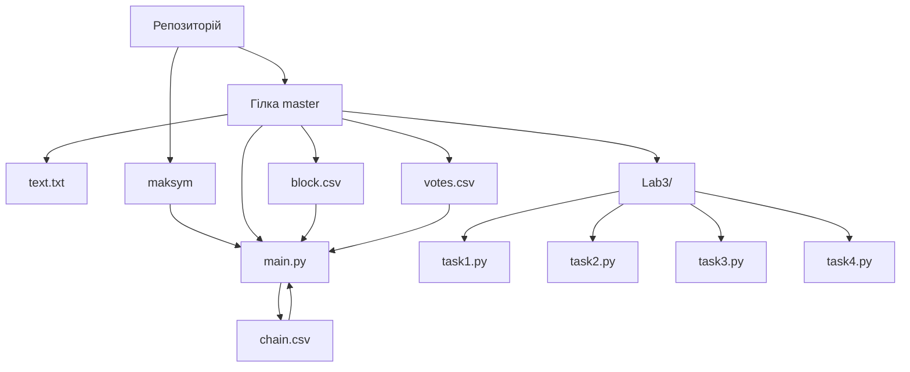

# Навчальна практика з Python  
## Репозиторій містить лабораторні роботи, виконані з курсу програмування

---

### Гілки

- `master` — основна гілка, в якій зберігається стабільна версія проєкту.  
- `MaksymOnyshko` — додаткова гілка для оновлення основного коду
---

### Файли

- `text.txt` — загальний текстовий файл  
- `block.csv` — файл з описом блоків (`id`, `view`)  
- `votes.csv` — файл з голосами за блоки  (`id`)
- `chain.csv` — згенерований файл із підтвердженими блоками (`id`, `view`, `value`)
- `main.py` — основний код лабораторної роботи №1  
- `Lab3/` — директорія з файлами третьої лабораторної роботи
  - `task1.py` — перше завдання лабораторної роботи №3
  - `task2.py` — друге завдання лабораторної роботи №3
  - `task3.py` — третє завдання лабораторної роботи №3
  - `task4.py` — четверте завдання лабораторної роботи №3

---

## Опис лабораторних робіт

### Lab1 — Blockchain Builder

У цій лабораторній роботі реалізовано систему побудови блокчейн-ланцюга на основі CSV-файлів.

- **Вхідні дані**:
  - `block.csv`: кожен блок має унікальний `id`, `view` (позицію в ланцюгу) та `value`
  - `votes.csv`: містить голоси за відповідні блоки
- **Обробка**:
  - Голоси використовуються для визначення, які блоки потрапляють до фінального ланцюга
  - Після обробки створюється файл `chain.csv` з підтвердженими блоками
### Lab4 — Blockchain Tree Builder
- **Аналіз**:
    - Зчитуються значення `value` з `chain.csv`
    - На їх основі будується **бінарне дерево пошуку (BST)**
    - Проводиться автоматичний аналіз дерева:
      - перевірка, чи є дерево:
         - **complete**
         - **full**
         - **perfect**
       - обхід дерева: **Pre-order**, **In-order**, **Post-order**

 ### Lab3 — Робота з регулярними виразами
Ця лабораторна робота складається з 4 завдань, що демонструють практичне використання модуля re для обробки тексту:

- Task 1 — Обробка слів у рядках:
Видалення спеціальних символів.
Пошук слів із заданим символом.
Пошук слів заданої довжини.
Пошук слів, які починаються з a або b і закінчуються на s.
- Task 2 — Збір грошових сум із тексту:
Пошук усіх значень типу $123.45.
Перетворення їх у числа.
Обчислення загальної суми.
- Task 3 — Очищення Python-коду:
Видалення коментарів (#).
Видалення зайвих порожніх рядків.
- Task 4 — Перетворення дат:
Зміна формату дати з YYYY-MM-DD на DD-MM-YYYY.

##  Діаграма структури проєкту (Mermaid)

    
